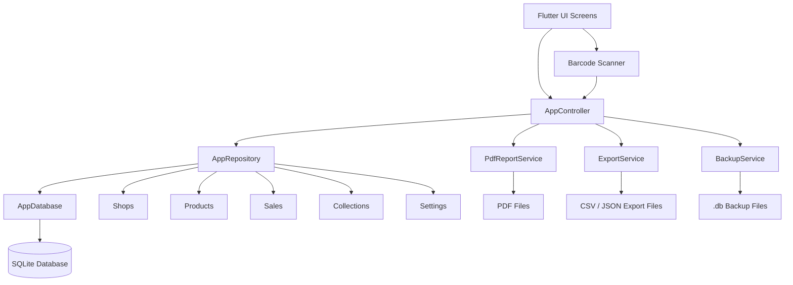
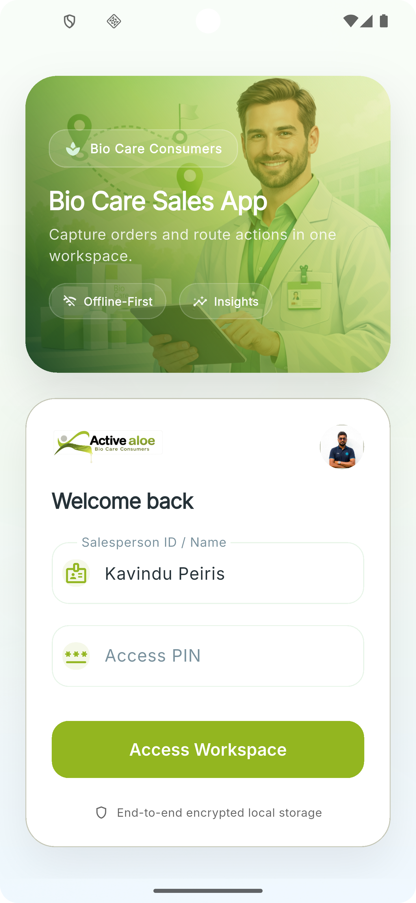
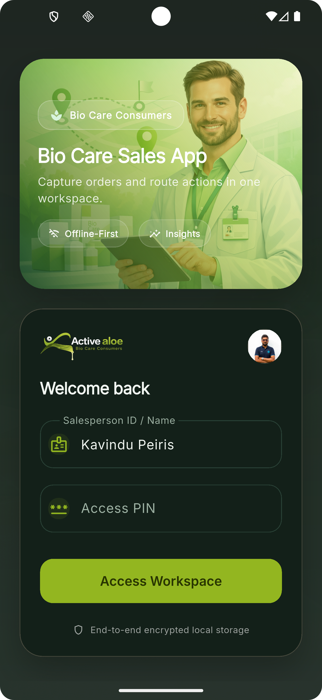
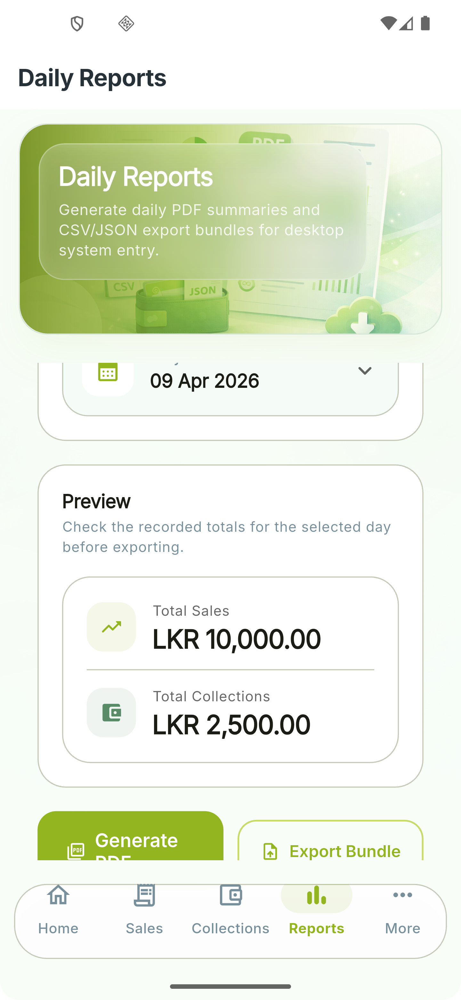
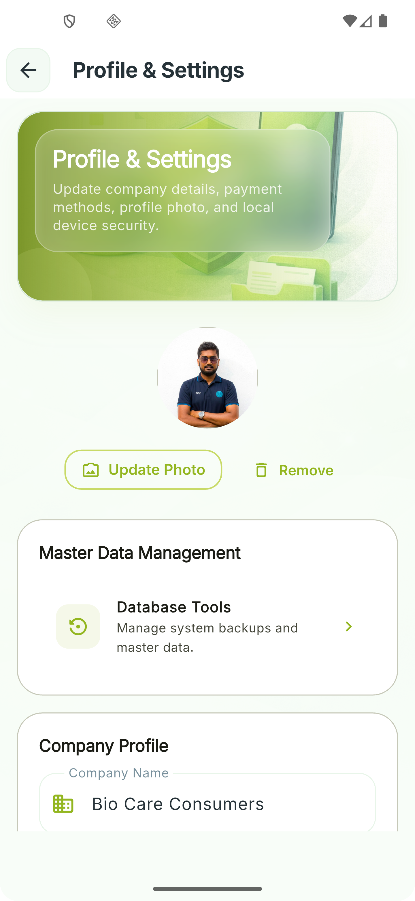

# 🌿 Bio Care Consumers Sales App

<p align="center">
  
</p>

<p align="center">
  
</p>


<p align="center">
  <strong>Offline-first Flutter app for field sales, collections, reporting, and master-data management.</strong>
</p>

<p align="center">
  
  
  
  
  
</p>

---

## 📖 Overview

Bio Care Consumers Sales App is a polished route-sales recorder built with Flutter and local SQLite storage. It helps a salesperson or route team manage shops, products, sales, collections, daily reports, exports, and backups directly on-device without depending on a live internet connection.

The app starts fast, seeds demo data for first-time use, stores business data locally, and provides reporting/export flows for desktop-side processing.

## ✨ Key Highlights

- Offline-first workflow with local SQLite persistence
- Secure local login with optional PIN protection
- Dashboard with daily KPIs, recent activity, and quick actions
- Shop management with balances, credit limits, and area-based details
- Product catalog management with SKU, pricing, descriptions, and barcodes
- Sales entry with multi-line items, discount handling, and barcode scan support
- Collection entry with payment methods and balance impact preview
- Sales and collection history with edit and void flows
- PDF daily report generation
- CSV and JSON export bundle generation for desktop import
- SQLite backup and restore support
- CSV/TXT import flows for shops and products
- Theme mode, profile photo, and local settings management

## 🧰 Tech Stack

| Layer | Tools |
|---|---|
| UI | Flutter, Material 3, `flutter_screenutil`, `google_fonts` |
| State Management | `provider` |
| Local Storage | `sqflite`, `path`, `path_provider` |
| Documents & Sharing | `pdf`, `share_plus` |
| File Operations | `file_picker` |
| Security | `crypto` |
| Scanning | `mobile_scanner` |
| Formatting | `intl` |

## 🗂️ Main Features

### 🔐 Authentication
- Login screen with salesperson name/ID
- Optional local PIN validation using SHA-256 hash storage
- Profile image support for a more personalized workspace

### 📊 Dashboard
- Daily sales, collections, cash sales, and credit sales metrics
- Recent route activity feed
- Quick actions for creating a sale or recording a collection
- Date-based summary view

### 🏪 Shop Management
- Create, edit, search, and deactivate shops
- Track area, phone, owner/contact, credit limit, and balance
- Bulk import shop master data from CSV/TXT files

### 📦 Product Management
- Create, edit, search, and deactivate products
- Maintain SKU, barcode, description, and pricing
- Bulk import product master data from CSV/TXT files

### 🧾 Sales
- Create and edit offline sales
- Add multiple line items per sale
- Cash or credit sale support
- Barcode-based product lookup
- Void recorded sales with a reason
- Automatic shop balance updates for credit sales

### 💰 Collections
- Record and edit received payments
- Support configurable payment methods
- Preview the outstanding balance after payment
- Void collections with a reason
- Automatic shop balance adjustments

### 📁 Reports, Export, and Backup
- Generate daily PDF reports
- Export CSV and JSON bundles for desktop import
- Share generated report/export files
- Create and restore SQLite backups

### ⚙️ Settings
- Update company name and default salesperson
- Configure payment methods
- Enable or disable PIN protection
- Switch between system, light, and dark theme modes

## 🏛️ Architecture

The project follows a clean, practical local-first structure:

- `main.dart` bootstraps the app and starts controller initialization
- `AppController` acts as the presentation/state layer
- `AppRepository` contains business logic and persistence coordination
- `AppDatabase` manages SQLite schema, versioning, and indexes
- `services/` handles PDF generation, export files, and backup flows
- `screens/` contains feature-focused UI modules
- `models/entities.dart` holds the core data models

## 🧭 Architecture Diagram



## 🗃️ Data Model Snapshot

The local database includes these primary tables:

- `shops`
- `products`
- `sales`
- `sale_items`
- `collections`
- `settings`

Notable behaviors already implemented in the repository layer:

- Default settings seeding
- Demo/mock data seeding on first run
- Balance updates after credit sales and collections
- Soft-voiding for sales and collections
- Search and filtering support
- CSV/TXT import parsing for shops and products
- Daily summary/report aggregation

## 📂 Project Structure

```text
lib/
  app/
    app.dart
    app_controller.dart
  core/
    theme/
    utils/
    widgets/
  data/
    app_database.dart
    app_repository.dart
  models/
    entities.dart
  screens/
    auth/
    dashboard/
    sales/
    collections/
    reports/
    shops/
    products/
    settings/
    data/
    more/
    shared/
  services/
    pdf_report_service.dart
    export_service.dart
    backup_service.dart
```

## 🚀 Getting Started

### Prerequisites

- Flutter SDK `>=3.3.0 <4.0.0`
- Dart SDK compatible with the Flutter version above
- Android Studio, VS Code, or another Flutter-capable IDE

### Installation

```bash
flutter pub get
flutter run
```

### Build Examples

```bash
flutter run -d android
flutter run -d windows
flutter build apk
flutter build windows
```

## 🧪 First-Run Behavior

On first launch, the app:

- Initializes the SQLite database
- Seeds default settings
- Seeds sample shops, products, sales, and collections if the database is empty
- Opens into the login flow, then routes into the main application shell

This makes the project demo-friendly and easier to review immediately.

## 📝 Import Formats

### Shops Import

Recommended headers:

```csv
name,owner_contact,area,phone,credit_limit,balance
```

### Products Import

Recommended headers:

```csv
name,sku,unit_price,description,barcode
```

The import logic accepts comma-separated or tab-separated text and can update existing records or replace current master data depending on the chosen flow.

## 📤 Output Locations

Generated files are stored inside the app documents directory:

- `reports/` for generated PDF reports
- `exports/` for CSV and JSON export bundles
- `backups/` for SQLite backup files

## 🖼️ Screenshots

<table>
  <tr>
    <td width="50%" valign="top">
      <h3>🔑 Login</h3>
      
    </td>
    <td width="50%" valign="top">
      <h3>🌙 Dark Theme</h3>
      
    </td>
  </tr>
  <tr>
    <td width="50%" valign="top">
      <h3>📈 Dashboard</h3>
      
      <br />
      <br />
      
    </td>
    <td width="50%" valign="top">
      <h3>🧾 Sales Module</h3>
      
      <br />
      <br />
      
    </td>
  </tr>
  <tr>
    <td width="50%" valign="top">
      <h3>💵 Collections Module</h3>
      
      <br />
      <br />
      
    </td>
    <td width="50%" valign="top">
      <h3>📦 Product Catalog</h3>
      
    </td>
  </tr>
  <tr>
    <td width="50%" valign="top">
      <h3>📊 Reports</h3>
      
    </td>
    <td width="50%" valign="top">
      <h3>⚙️ Settings</h3>
      
    </td>
  </tr>
  <tr>
    <td width="50%" valign="top">
      <h3>🏪 Shops Management</h3>
      
    </td>
    <td width="50%" valign="top">
      <h3>🌿 Bio Care Visuals</h3>
      
    </td>
  </tr>
</table>

## 🔍 Notable UX Details

- Responsive sizing through `flutter_screenutil`
- Custom visual identity using bundled Bio Care image assets
- Dedicated hero art for login, dashboard, sales, collections, reports, shops, products, and settings
- Reusable cards and shell components for consistent layout and presentation

## 🛡️ Local Security Notes

- PIN protection is optional and stored locally
- PIN values are hashed before persistence
- Data is designed for local/offline operation rather than cloud sync

## 📌 Current Repository Notes

- The app is mobile-focused but includes Flutter platform folders for Android, iOS, web, Windows, Linux, and macOS
- A PowerShell tool folder is included for icon generation/replacement tasks
- The repository already contains branded screenshots and artwork suitable for product presentation

## 📄 License

No license file is currently included in this repository. Add one if you plan to distribute or open-source the project.
